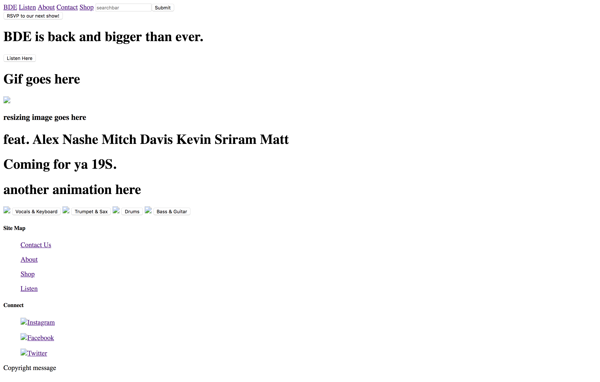
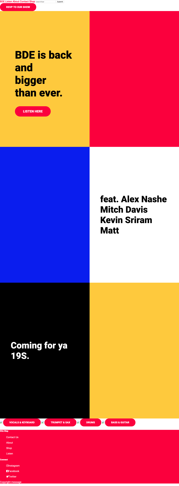
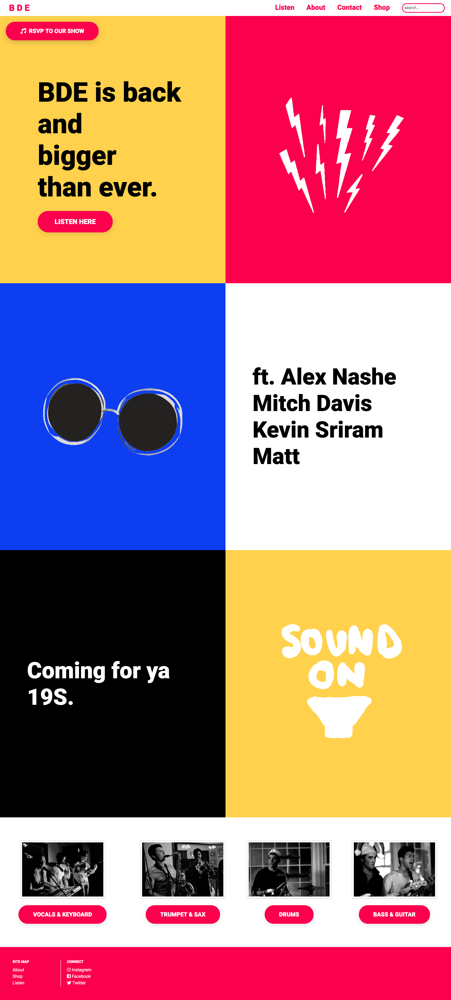
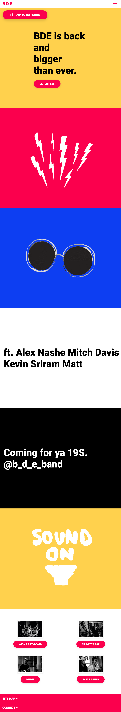
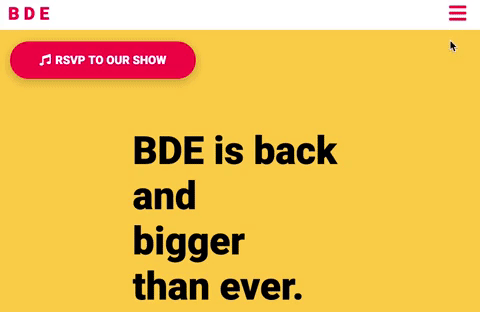

# Lab 1 - Landing Page

## Assignment
I used [Houseparty.com](https://houseparty.com/) as inspiration to create a website for the student band *BDE*. I really liked the colors and blocky structure of the original site, so I kept most of the design the same and just replaced the content with information and photos related to the group. I also added in a few lab-specific elements like the top navigation bar and size-responsive menu. My version is hosted [here](https://dartmouth-cs52-19s.github.io/lab1-landingpage-emmalangfitt/).

## Process
The lab first asked us to use pure HTML to form the structure of the site. With absolutely no styling and just about 100 lines of code, my landing page looked like this: 

  

After this, I organized the page with flexboxes and added styling elements like colors with CSS. With a bit more styling the page looked like this:

  

And then finally adding in proper images and final touches it became:

  

The last step of the lab was to make the page responsive to window resizing, so there is a narrow mobile-sized version of the site and a regular wide version of the site. To make my page responsive, I turned the top nav bar into a hamburger menu and had the footer links stack into drop-down menus. Also, the colorblocks switched from being side-by-side to stacked one on top of the other. The mobile version ended up looking like this: 

  

When you click the hamburger icon, a menu drops down like this:

  

From here I cleaned up the code, touched up a few styling elements, and hosted the site!  

## Results
Overall, I created a landing page mockup with the follwing features:

* a responsive navigation menu that turns into a clickable hamburger icon when the screen is narrow
* an animated drop-down menu that responds to the hamburger click (via the CSS checkbox hack)
* expanding gifs and images within the colorblocks
* call-to-actions, links, and buttons with hover states
* local links to different sections of the page
* a non-functional text-input searchbar
* a responsive resizing footer with non-function drop-downs 

One thing I'd like to fix in the future is the CSS checkbox hack. It worked, but the transition wasn't smooth since the text appears before the menu full drops down and the icon's hover effect is masked by the checkbox. I think I could find a sneaky way to make the icon change color when the checkbox is hovered over, but I couldn't get this to work. However, the checkbox works as a rough approximate of what I'd like the menu to look like, and it was cool to do it with pure CSS.
